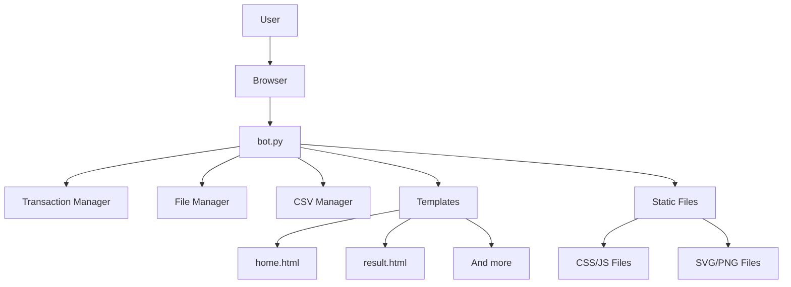
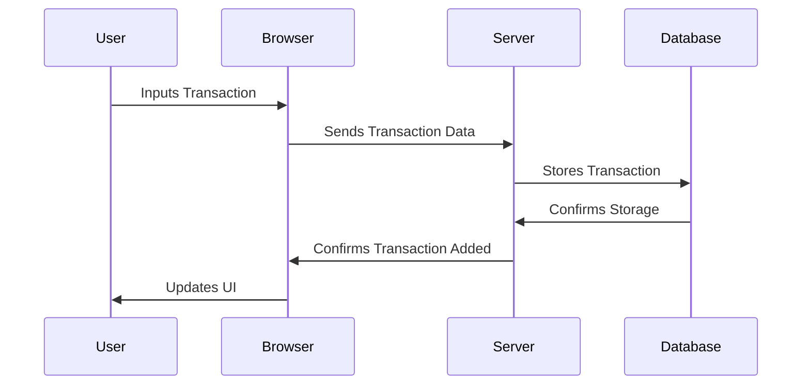
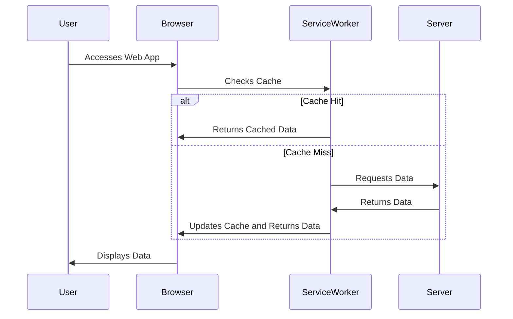

<h1 align="center">
  <a
    href="https://github.com/Dao-you/SimplestBookkeepingPWA"
    style="
      width: 170px;
      height: 170px;
      overflow: hidden;
      display: inline-block;
      vertical-align: middle;
    "
  >
    
  </a>
</h1>

<h1 align="center">
<b>SimplestBookkeepingPWA</b>
<i><p><small>Host your bookkeeping app on your own!</small></p></i>
</h1>

SimplestBookkeepingPWA is a minimalist, cloud-based bookkeeping application designed to simplify the task of financial record-keeping. This project features a user-friendly interface, cloud storage, and Progressive Web App (PWA) capabilities, making it accessible from any device. The application supports responsive design, one-handed use, and includes import/export functionality for easy data management.

## Key Features

1. **Super Simple Interface**:

   - Clean and intuitive interface designed to make bookkeeping easy and less cumbersome.

2. **Cloud-Based Storage**:

   - All user data is stored securely on the server, allowing access from any device with an internet connection.

3. **Progressive Web App (PWA) Design**:

   - Accessible via a web browser or installable as a standalone app on devices.

4. **Responsive Web Design (RWD)**:

   - Automatically adjusts layout to suit any screen size, ensuring optimal usability on all devices.

5. **One-Handed Use**:

   - Interface optimized for single-handed operation on mobile devices.

6. **Import and Export Capabilities**:

   - Users can import and export financial data in spreadsheet format for easy data management and backup.

7. **Dark Mode**:
   - Supports dark mode for comfortable use at night.

## Installation

To install and run the SimplestBookkeepingPWA, follow these steps:

1. Clone the repository:

   ```sh
   git clone https://github.com/Dao-you/SImplestBookkeepingPWA.git
   cd SimplestBookkeepingPWA
   ```

2. Install the necessary dependencies:

   ```sh
   pip install -r requirements.txt
   ```

3. Configure HTTPS:

   - PWA functionalities require HTTPS. To add your SSL certificate, update the `SSLconfig.json` file with your certificate paths:
     ```json
     {
       "certfile": "path/to/your/cert.pem",
       "keyfile": "path/to/your/key.pem"
     }
     ```
   - The program will attempt to read the SSL configuration from `SSLconfig.json`. If it fails, it will run using unencrypted HTTP, but PWA features will be unavailable.
   - For more information on obtaining SSL certificates, you can refer to these guides:
     - [Let's Encrypt](https://letsencrypt.org/getting-started/)
     - [SSL for Free](https://www.sslforfree.com/)

4. Run the application:

   ```
   python bot.py
   ```

5. Network Settings:
   - Ensure proper network settings to allow access from other devices. Refer to these guides for more details:
     - [Port Forwarding](https://www.howtogeek.com/66214/how-to-forward-ports-on-your-router/)
     - [How to Set Up a Static IP Address](https://www.pcmag.com/how-to/how-to-set-up-a-static-ip-address)
     - [What is dynamic DNS?](https://aws.amazon.com/tw/what-is/dynamic-dns/)
     - [Duck DNS - free dynamic DNS](https://www.duckdns.org/)

## User Guide

### Frontend

- Home Page:

  - Input transactions in the format \<price>/\<description>.
  - Add custom transaction types using the links at the bottom of the UI.
  - Submit an empty form to display transaction records.

- Result Page:

  - View all recorded transactions.
  - Edit or delete existing transactions by clicking it.
  - Export transaction records to a CSV file.

## Application Structure



- Bot.py: Routes defination and processition data from frontend

- File Manager: Manages file operations for storing and retrieving data.

- CSV Manager: Manages CSV import and export operations.

### Frontend and Backend Interaction



When a user interacts with the web application, the frontend (browser) and backend (server) collaborate to process and store transactions seamlessly. Here's a step-by-step breakdown:

1. User Inputs Transaction:

   - The user enters a transaction through the input form on the homepage.

1. Browser Sends Data to Server:

   - Upon submission, the browser sends the transaction data to the server via an HTTP POST request.

1. Server Processes Data:

   - The server, using bot.py, processes the incoming transaction data.

1. Database Storage:

   - The server stores the transaction data in the database and confirms the storage.

1. Server Response:

   - The server sends a confirmation response back to the browser.

1. UI Update:
   - The browser updates the UI to reflect the new transaction, providing real-time feedback to the user.

### PWA Functionality

Progressive Web Apps (PWAs) combine the best of web and mobile apps. Key features include:

- Offline Capability: Using service workers, PWAs cache assets and data to work offline.
- Installability: PWAs can be installed on devices from the browser, appearing like native apps.
- Performance: PWAs use caching and other strategies to ensure fast load times and smooth performance.

This project utilizes a service worker (sw.js) to cache necessary files and ensure offline functionality. Here's how it works:



1. User Accesses Web App:

   - The user opens the web app in the browser.

1. Service Worker Checks Cache:

   - The service worker checks if the required data is already cached.

1. Cache Hit or Miss:

   - If the data is cached (cache hit), it returns the data to the browser immediately.
   - If the data is not cached (cache miss), the service worker requests the data from the server.

1. Data Retrieval:

   - The server responds with the requested data.
   - The service worker caches this new data for future use.

1. Browser Displays Data:
   - The browser displays the data to the user, ensuring a smooth and efficient user experience even with intermittent internet connectivity.

---

By following this structure, you will have a clearer understanding of how the application operates and how to use its features effectively. For a complete code reference and further details, please refer to the repository [here](<(https://github.com/Dao-you/SimplestBookkeepingPWA).>).
